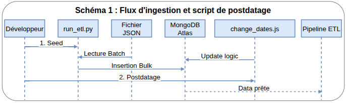
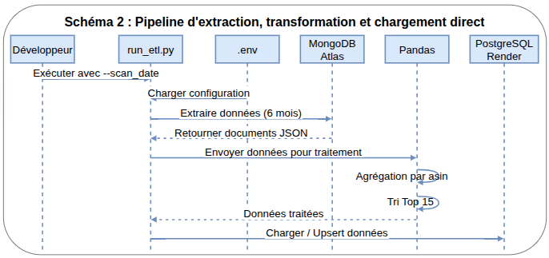

<h1>Video Games ETL Pipeline</h1>
<h2>Technical & Operational Documentation</h2>


<p>
<style>  
    pre, code { font-size: 12px !important; }  /* for code blocks font=12px */
    td {padding: 3px !important;}  /* for tables, horizontal padding = 3px */
</style>
</p>


**Table of Contents**

- [1. General Overview](#1-general-overview)
  - [Business Objectives](#business-objectives)
- [2. Project Specifications](#2-project-specifications)
  - [2.1 Business Requirements \& Management Rules](#21-business-requirements--management-rules)
  - [2.2 Technical Data Specifications](#22-technical-data-specifications)
- [3. Technical Solution \& Architecture](#3-technical-solution--architecture)
  - [3.1 Stack and Tools](#31-stack-and-tools)
  - [3.2 Project Directory Tree](#32-project-directory-tree)
  - [3.3 Architecture Diagram](#33-architecture-diagram)
    - [1. Ingestion and Preparation (Profile: Developer)](#1-ingestion-and-preparation-profile-developer)
    - [2. Manual Pipeline Execution (Profile: Developer)](#2-manual-pipeline-execution-profile-developer)
    - [3. Orchestration and Deployment (Profile: Administrator)](#3-orchestration-and-deployment-profile-administrator)
    - [4. Data Consumption (Profile: Analysts \& Decision Makers)](#4-data-consumption-profile-analysts--decision-makers)
  - [3.4 Data Schema](#34-data-schema)
    - [Datalake (MongoDB NoSQL)](#datalake-mongodb-nosql)
    - [Data Warehouse (SQL)](#data-warehouse-sql)
  - [3.5 Traceability Matrix](#35-traceability-matrix)
  - [3.6 Engineering Enhancements](#36-engineering-enhancements)
- [4 Deployment Guide (Administrator)](#4-deployment-guide-administrator)
  - [Step 1: Cloud Infrastructures Provisioning](#step-1-cloud-infrastructures-provisioning)
  - [Step 2: Codebase Cloning and Dependency Setup](#step-2-codebase-cloning-and-dependency-setup)
  - [Step 3: Launching and Initializing Airflow Services](#step-3-launching-and-initializing-airflow-services)
- [5 Developer Guide](#5-developer-guide)
  - [Direct Local ETL Execution](#direct-local-etl-execution)
  - [Automated Dataset Seeding](#automated-dataset-seeding)
  - [Database Maintenance (Date Postdating)](#database-maintenance-date-postdating)
  - [Logical Data Flow Sequencing](#logical-data-flow-sequencing)
  - [Aggregation Logic Blocks](#aggregation-logic-blocks)
- [6 Monitoring \& Infrastructure Maintenance](#6-monitoring--infrastructure-maintenance)
    - [Orchestration Engine (Airflow):](#orchestration-engine-airflow)
    - [Data Warehouse Quality Checks:](#data-warehouse-quality-checks)

<div style="page-break-after: always;"></div>

## 1. General Overview
This document defines the architecture, configuration, and operation of the automated ETL pipeline. The primary objective is to extract raw customer reviews stored in a NoSQL database daily, identify community trends, and populate a relational Data Warehouse (DWH).


### Business Objectives
* **Catalog Optimization**: Feature the top-rated and most appreciated games on the website's homepage and in marketing communication channels (newsletters, social media networks).
* **Data Freshness**: Maintain a day-by-day historical record of the top 15 highest-rated games based exclusively on customer reviews submitted over the last 6 months.


<div style="page-break-after: always;"></div>


## 2. Project Specifications

### 2.1 Business Requirements & Management Rules
* **Rolling Window**: Strict exclusion of any product review submitted more than 6 months prior to the execution date.
* **Top 15**: Daily calculation based on average ratings and overall review volume to extract exactly the top 15 references.
* **Idempotence & Uniqueness**: Zero tolerance for duplicate entries. If the pipeline runs multiple times on the same logical day, existing records for that specific date must be overwritten and replaced (**Upsert / Replace Strategy**).


### 2.2 Technical Data Specifications
The raw source data originates from a compressed JSON stream ingested into MongoDB Atlas.

* **Source Stream (JSON File)**

    Each entry represents a single customer review containing the following fields:
    * **reviewerID**: Unique identifier of the user.
    * **verified**: Boolean flag indicating if the purchase is verified (ETL filtering criterion).
    * **asin**: Unique product identifier (Amazon Standard Identification Number).
    * **reviewerName**: Name or handle of the author.
    * **vote**: Number of helpful votes received by the review.
    * **style**: Dictionary describing the product format (e.g., "Digital Download").
    * **reviewText**: Text body of the review (dropped during ingestion to optimize cluster storage capacity).
    * **overall**: Numerical rating ranging from 1 to 5.
    * **summary**: Headline or summary title of the review.
    * **unixReviewTime**: Unix Timestamp (used to calculate the dynamic 6-month rolling window).
    * **reviewTime**: Formatted string date (e.g., "05 22, 2024").
    * **image**: A list of URLs pointing to images uploaded by the customer.

* **Datalake (MongoDB NoSQL)**

    The staging collection stores the filtered fields extracted from the raw file required by the target schema. 
    Only the necessary fields from the file need to be fetched.

* **Target DWH (SQL)**
    The final target relational table features the following columns:
    * Unique game identifier (ASIN)
    * Calculated average rating
    * Total count of users who rated the game
    * Oldest review rating retained in the rolling window
    * Most recent review rating recorded in the rolling window
    * Calculation execution date


<div style="page-break-after: always;"></div>


## 3. Technical Solution & Architecture

### 3.1 Stack and Tools
* **Programming Languages**: Python 3.11, JavaScript
* **Storage Infrastructure**: MongoDB Atlas (Source Database), PostgreSQL on Render (Data Warehouse).
* **Data Processing**: Pandas & MongoDB Aggregation Framework.
* **Orchestration Engine**: Apache Airflow (Local Environment / Server Instance).
* **IDE**: Visual Studio Code
    * **Extensions**: 
        * MongoDB for VS Code
        * SQLTools 
        * SQLTools PostgreSQL/Cockroach Driver 
        * SQLite Viewer
* **Operating System**: Ubuntu Linux. (The Airflow Scheduler strictly requires a Unix-like OS environment to support task process handling via `os.fork`).


### 3.2 Project Directory Tree
```text
BlentDataProject/
├── .venv_airflow/            # Dedicated virtual environment for Airflow
├── .venv_etl/                # Dedicated virtual environment for the ETL script
├── airflow_home/             # Airflow working directory (Logs, local DB)
│   ├── airflow.db            # Orchestrator SQLite database
│   └── dags/                 # Airflow DAGs folder
│       └── dag_task_etl.py   # Airflow 2.3 DAG definition & integrated documentation
├── doc/                      # Technical and functional specifications
├── queries/                  # Maintenance scripts (MongoDB/SQL migrations)
├── scripts/
│   └── run_etl.py            # Python script (Extraction, Calculations, Loading)
├── src/                      # Core logic (lib_etl.py, config.py)
├── .env.template             # Secrets template (MongoDB, Postgres)
├── .gitignore                # Exclusions for virtual environments, logs, and .env
├── airflow.env               # Path environment variables (PROJECT_ROOT, AIRFLOW_HOME)
├── airflow_run_etl.sh        # Control script (Servers & execution modes)
├── README.md                 # Overview and quick-start guide
├── requirements_airflow.txt  # Orchestrator dependencies
└── requirements_etl.txt      # ETL script dependencies
```


<div style="page-break-after: always;"></div>


### 3.3 Architecture Diagram
This section details data streams and architecture components mapped across different user profiles and business roles.

#### 1. Ingestion and Preparation (Profile: Developer)
* **Objective**: Seed the Datalake with workable development datasets.  
* **Process**: Loading the source JSON file using the `seed_datalake` function, followed by a date-shifting script to map older documents into a modern 6-month execution window.
* *Ref. Diagram 1: Ingestion workflow and timestamp-shifting script*





#### 2. Manual Pipeline Execution (Profile: Developer)
* **Objective**: Perform isolated unit testing or execute performance benchmarks.  
* **Process**: Triggering the entry-point script `run_etl.py` directly from the CLI using `--scan_date` and `--platform` arguments.
* *Ref. Diagram 2: Direct Extraction, Transformation, and Loading pipeline*





<div style="page-break-after: always;"></div>


#### 3. Orchestration and Deployment (Profile: Administrator)
* **Objective**: Management of background service infrastructure and production automation.  
* **Components**: A control shell script `airflow_run_etl.sh` driving 2 daemon processes (Webserver & Scheduler) paired with an `airflow.db` metadata instance.  
* **Operation Modes**: Daily Schedule (Automated), Test (Unit testing), Backfill (Historical catching up).
* *Ref. Diagram 3: Airflow orchestration architecture and execution modes*


#### 4. Data Consumption (Profile: Analysts & Decision Makers)
* **Objective**: Business trend monitoring and decision support analytics.  
* **Flow**: Render PostgreSQL DWH ➔ Standard SQL Queries ➔ Analytics Reports / Marketing Newsletters / Web Catalog App.
* *Ref. Diagram 4: Final SQL data consumption workflow*


<div style="page-break-after: always;"></div>


### 3.4 Data Schema

#### Datalake (MongoDB NoSQL)

The collection schema stores data with the following technical fields:
| Column | Type | Description |
| :--- | :--- | :--- |
| `asin` | str | Unique product identifier (ASIN). |
| `reviewerID` | str | Unique user identifier. |
| `overall` | float | Numerical rating from 1 to 5. |
| `verified` | bool | Boolean flag indicating a verified purchase. |
| `unixReviewTime` | int | Unix Epoch Timestamp. |
| `reviewTime` | str | Formatted date text. |

#### Data Warehouse (SQL)

The target relational table `daily_snapshot` enforces the following schema to ensure historical consistency and idempotence:
| Column | Type | Description |
| :--- | :--- | :--- |
| `product_id` | VARCHAR(50) | Unique game identifier (ASIN). |
| `snapshot_date` | DATE | Pipeline calculation execution day (Composite Primary Key with product_id). |
| `nb_reviews` | INTEGER | Number of valid reviews aggregated within the 6-month window. |
| `average_rating` | NUMERIC(3,2) | Calculated arithmetic mean rating (1.00 to 5.00). |
| `oldest_rating` | NUMERIC(3,2) | Rating value of the oldest review in the current period. |
| `newest_rating` | NUMERIC(3,2) | Rating value of the latest review in the current period. |


<div style="page-break-after: always;"></div>


### 3.5 Traceability Matrix


<div style="font-size: 11px; line-height: 1.2;">


| Requirement Segment | Specific Requirement | Script (directory) | Implementation Status & Comments |
| :--- | :--- | :--- | :--- |
| **Source Data** | Raw dataset hosted in MongoDB | `lib_etl.py (src)` | Implemented. `connect_mongo` and `extract_and_transform` use `pymongo` to query the source cluster collection. |
| **Data Warehouse** | SQL Compliant Infrastructure (PostgreSQL) | `lib_etl.py (src)` | Implemented. Uses `sqlalchemy` and `psycopg2` (via explicit connection string DSN) pointing to the Render PostgreSQL instance. |
| **Data Filtering** | Restrict dataset to the last 6 months | `lib_etl.py (src)` | Implemented. `get_timeframe_start` calculates the 6-month delta, and `extract_and_transform` leverages a `$match` operator on `unixReviewTime`. |
| **Aggregation Rules** | Extract top 15 highest-rated games | `lib_etl.py (src)` | Implemented. Aggregation pipeline enforces a `$limit: top_n` (defaulting to 15) after sorting records by `average_rating` and `nb_reviews`. |
| **Data Schema Matching** | Product ID, Average, Count, Oldest/Newest bound ratings | `lib_etl.py (src)` | Implemented. `init_dwh` initializes the schema with appropriate constraints for `product_id`, `nb_reviews`, `average_rating`, `oldest_rating`, and `newest_rating`. |
| **Idempotence Enforcer** | Handle duplicate execution runs cleanly | `lib_etl.py (src)` | Implemented. `upsert_dwh` executes an atomic row `DELETE` for the targeted `snapshot_date` right before triggering the DataFrame `append`. |
| **Core App Logic** | Standalone Python execution script | `run_etl.py (src)` | Implemented. The primary CLI entry point script coordinates individual Extract, Transform, and Load phases sequentially. |
| **Automation** | Orchestration & Job Scheduling engine | `airflow_run_etl.sh` | Implemented. Control Bash script manages local environment properties, background daemon systems, and explicit backfilling. |
| **Data Integrity** | Filter out unverified product reviews | `lib_etl.py (src)` | Implemented. The primary MongoDB server-side aggregation stage explicitly filters records where `verified: True`. |


</div>


**Project Status Assessment Summary:**
* **Date Management**: Transitioning legacy sample datasets (dated around 2017) to a modern execution timeline was successfully implemented using the maintenance utility `queries/datalake/change_dates.mongodb.js`. This guarantees that the dynamic 6-month historical calculations yield consistent rows during active production testing.
* **Schema Consistency**: The database creation DDL block within `src/lib_etl.py` configures a composite `PRIMARY KEY (product_id, snapshot_date)`. This fulfills the requirement to eliminate multi-run data pollution while preserving true daily metrics tracking for individual games over time.


### 3.6 Engineering Enhancements
1.  **Performance Optimization**: Offloading computations using the native MongoDB `aggregate` pipeline reduces network overhead and minimizes data transfer into Python.
2.  **Pipeline Robustness**: Implementing contextual SQLAlchemy database transactions (`db_dwh.begin()`) protects data warehouse integrity during append sequences.
3.  **Security Architecture**: Completely decoupled secret configurations via local `.env` environment isolation.


<div style="page-break-after: always;"></div>


## 4 Deployment Guide (Administrator)

### Step 1: Cloud Infrastructures Provisioning
1.  **MongoDB Atlas (Source Datalake):**
    * Deploy a Shared/Free M0 tier cluster instance.
    * Under **Network Access**, whitelist your runner IP address (or assign `0.0.0.0/0` during development testing).
    * Under **Database Access**, create a dedicated application user account with `readWrite` access privileges (required to seed initial testing objects).
    * Retrieve your secure cluster connection URI string (`mongodb+srv://...`).
2.  **Render PostgreSQL (Data Warehouse Target):**
    * Provision a new managed **PostgreSQL** cloud instance.
    * Configure database user credentials.
    * Copy down the **External Connection String**.

### Step 2: Codebase Cloning and Dependency Setup
```bash
# 1. Clone the project repository
git clone https://github.com/votre-compte/BlentDataProject.git
cd BlentDataProject

# 2. Configure application secrets
cp .env.template .env
# Edit the newly created .env file with your custom MongoDB and PostgreSQL strings

# 3. Initialize separate virtual environments
python3.11 -m venv .venv_airflow
python3.13 -m venv .venv_etl

# 4. Install requirements packages across environments
source .venv_airflow/bin/activate && pip install -r requirements_airflow.txt && deactivate
source .venv_etl/bin/activate && pip install -r requirements_etl.txt && deactivate
```

### Step 3: Launching and Initializing Airflow Services
Execute the primary orchestration control script to spin up background operations:
```bash
chmod +x airflow_run_etl.sh
./airflow_run_etl.sh
```
This management script automatically orchestrates:
1.  The provisioning of the `airflow_home` directory structures and initializing `airflow.db`.
2.  The programmatic injection of an `admin` security profile account.
3.  The clean initialization of the Airflow **Scheduler** and **Webserver** running on port 8080 as detached background daemons.


<div style="page-break-after: always;"></div>


## 5 Developer Guide

### Direct Local ETL Execution
Developers can bypass the Airflow UI layers to run unit tests on the pipeline processing layer directly:
```bash
source .venv_etl/bin/activate

# Execute the pipeline using the current runtime date context
python scripts/run_etl.py

# Execute the pipeline passing an explicit target date (ISO format string)
python scripts/run_etl.py --scan_date 2024-05-20 --platform Terminal
```

### Automated Dataset Seeding
The entry point script `run_etl.py` handles bootstrap actions during its very first initialization sequence:
* **MongoDB Atlas Seeding**: If the destination staging database contains zero documents, the system triggers `seed_datalake` to automatically parse and load items from the packaged JSON file.
* **PostgreSQL DDL Initialization**: The inner utility `init_dwh` automatically provisions the target relational schema layout `daily_snapshot` alongside optimized tracking indices if they do not exist.

### Database Maintenance (Date Postdating)
If testing datasets fall outside your 6-month processing calculation scope:
* Open your workspace using Visual Studio Code.
* Access your target server connection through the official MongoDB Extension.
* Open the query scratchpad file located at `queries/datalake/change_dates.mongodb.js`.
* Click the interactive execution **Play** icon to shift timestamps forward.


### Logical Data Flow Sequencing
1.  **Extract**: Execute a targeted aggregation pipeline matching documents where `unixReviewTime` is equal to or greater than the historical constraint boundaries ($Date - 6 \text{ Months}$) while verifying that `verified: true`.
2.  **Transform**: 
    * Sort records chronologically.
    * Group values under distinct `asin` document clusters.
    * Compute arithmetic rating means and isolate initial boundaries using `$first` and `$last` operators.
    * Order structural output by `average_rating` and `nb_reviews` fields descending.
    * Enforce a processing limit constraint to truncate results down to the top 15 records.
3.  **Load**:
    * Open an isolated database transaction window.
    * Clear out prior target tracking entries matching the current operational `snapshot_date`.
    * Perform a high-speed relational bulk insert using the processed data framework.


<div style="page-break-after: always;"></div>


### Aggregation Logic Blocks
The core metric computation engine utilizes the server-side MongoDB pipeline within `extract_and_transform`. This architecture offloads calculations, filtering, and statistical sorting tasks to the hosting database machine.

```python
# Extracted pipeline code block definition
pipeline = [
    {"$match": {"unixReviewTime": {"$gte": timeframe_start}, "verified": True}},
    {"$sort": {"unixReviewTime": 1}},
    {"$group": {
        "_id": "$asin",
        "nb_reviews": {"$sum": 1},
        "average_rating": {"$avg": "$overall"},
        "oldest_rating": {"$first": "$overall"},
        "newest_rating": {"$last": "$overall"}
    }},
    {"$sort": {"average_rating": -1, "nb_reviews": -1}},
    {"$limit": 15}
]
```

<div style="page-break-after: always;"></div>


## 6 Monitoring & Infrastructure Maintenance


#### Orchestration Engine (Airflow):
* **Job Triggering & Service CLI Interfaces:**
    * **Spin Up Core Servers**: Run `./airflow_run_etl.sh` without passing any command-line parameters.
    * **Isolated Date Unit Verification**: Run the shell utility passing a target ISO date string parameter (e.g., `./airflow_run_etl.sh 2024-05-20`). This boots an internal `airflow tasks test` routine to validate pipeline logic without recording state mutations in the scheduler history database.
    * **Historical Backfilling**: To process an extensive chronological window on demand, invoke: `./airflow_run_etl.sh <start_date> <end_date>`.
        * *Important Note*: The global absolute lower-bound start constraints are defined via configuration properties within `airflow.env`. Verify that valid source records exist on your MongoDB instances before backfilling target periods.

* **System Health Monitoring:**
    * **Web Management Portal**: Connect to the running Airflow server UI by loading `http://localhost:8080`.
        * **Control Panel Dashboard**: Toggle the switch to activate the target `daily_scan` scheduling graph.

#### Data Warehouse Quality Checks:
Run verification scripts directly against your tables to check the computed results for a specific execution run:
```sql
SELECT * FROM public.daily_snapshot 
WHERE snapshot_date = <TARGET_DATE YYYY-MM-DD>;
```

---
*J. Vallée - 2026-05-20*