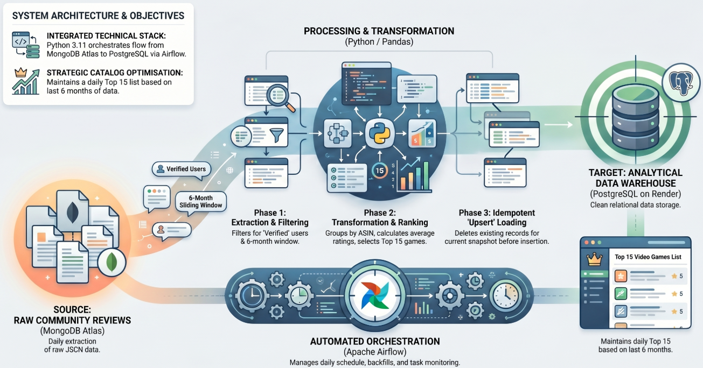
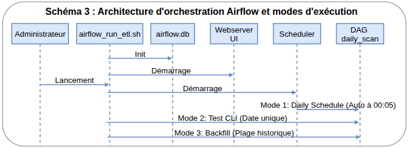
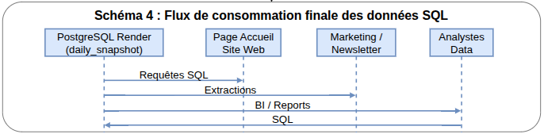

<h1>Pipeline ETL Jeux-Vidéo</h1>
<h2>Documentation Technique & Opérationnelle</h2>

<style>
    pre, code { font-size: 12px !important; } /* for code blocks font=12px */
    td {padding: 3px !important;} /* for tables, horizontal padding = 3px */
</style>

**Table de matières**

- [1. Présentation générale](#1-présentation-générale)
  - [Objectifs Business](#objectifs-business)
- [2. Cahier des charges](#2-cahier-des-charges)
  - [2.1 Besoins Métier \& Règles de Gestion](#21-besoins-métier--règles-de-gestion)
  - [2.2 Spécifications Techniques des Données](#22-spécifications-techniques-des-données)
- [3. Solution Technique \& Architecture](#3-solution-technique--architecture)
  - [3.1 Outils](#31-outils)
  - [3.2 Arborescence du Projet](#32-arborescence-du-projet)
  - [3.3 Diagramme d'Architecture](#33-diagramme-darchitecture)
    - [1. Ingestion et Préparation (Profil : Développeur)](#1-ingestion-et-préparation-profil--développeur)
    - [2. Exécution Manuelle du Pipeline (Profil : Développeur)](#2-exécution-manuelle-du-pipeline-profil--développeur)
    - [3. Orchestration et Déploiement (Profil : Administrateur)](#3-orchestration-et-déploiement-profil--administrateur)
    - [4. Exploitation de la Donnée (Profil : Analystes \& Décideurs)](#4-exploitation-de-la-donnée-profil--analystes--décideurs)
  - [3.4 Schéma de données](#34-schéma-de-données)
    - [Datalake (MongoDB No-SQL)](#datalake-mongodb-no-sql)
    - [Datawarehouse (SQL)](#datawarehouse-sql)
  - [3.5 Référencement des Données](#35-référencement-des-données)
  - [3.6 Matrice de traçabilité](#36-matrice-de-traçabilité)
  - [3.7 Choix d'amélioration](#37-choix-damélioration)
- [4 Guide de Déploiement (Administrateur)](#4-guide-de-déploiement-administrateur)
  - [Étape 1 : Préparation des Infrastructures Cloud](#étape-1--préparation-des-infrastructures-cloud)
  - [Étape 2 : Clonage et Configuration logicielle](#étape-2--clonage-et-configuration-logicielle)
  - [Étape 3 : Mise en service d'Airflow et Initialisation](#étape-3--mise-en-service-dairflow-et-initialisation)
- [5 Guide du Développeur](#5-guide-du-développeur)
  - [Lancement du script ETL en direct](#lancement-du-script-etl-en-direct)
  - [Initialisation automatique des données](#initialisation-automatique-des-données)
  - [Maintenance des données (Postdatage)](#maintenance-des-données-postdatage)
  - [Flux logique](#flux-logique)
  - [Algorithme d'agrégation](#algorithme-dagrégation)
- [6 Monitoring et Exploitation](#6-monitoring-et-exploitation)
    - [Orchestrateur __Airflow__ :](#orchestrateur-airflow-)
    - [Vérification DWH :](#vérification-dwh-)

<div style="page-break-after: always;"></div>

## 1. Présentation générale
Ce document définit l'architecture, la configuration et l'exploitation du pipeline ETL automatisé. L'objectif est d'extraire quotidiennement les avis bruts stockés sur une base NoSQL, d'identifier les tendances de la communauté, et d'alimenter un Data Warehouse (DWH) relationnel.




### Objectifs Business
*   **Optimisation du catalogue** : Mettre en avant sur la page d'accueil et dans les campagnes de communication (newsletters, réseaux sociaux) les jeux les mieux notés.
*   **Fraîcheur des données** : Historiser jour par jour les 15 jeux les mieux notés en se basant exclusivement sur les avis des 6 derniers mois.


<div style="page-break-after: always;"></div>


## 2. Cahier des charges

### 2.1 Besoins Métier & Règles de Gestion
*   **Fenêtre Glissante** : Exclusion stricte de tout avis ayant plus de 6 mois d'antériorité par rapport à la date d'exécution.
*   **Top 15** : Calcul quotidien basé sur la note moyenne et le volume d'avis pour extraire exactement les 15 meilleures références.
*   **Idempotence & Unicité** : Tolérance zéro pour les doublons. Si le pipeline s'exécute plusieurs fois pour la même journée, les anciennes données de cette journée doivent être écrasées et remplacées (**Stratégie Upsert / Replace**).


### 2.2 Spécifications Techniques des Données
Les données brutes proviennent d'un flux JSON compressé intégré dans MongoDB Atlas.

*   **Source Flux (fichier JSON)**

    Chaque entrée représente un avis client avec les champs suivants :
    *   **reviewerID** : Identifiant unique de l'utilisateur.
    *   **verified** : Booléen indiquant si l'achat est vérifié (critère de filtrage ETL).
    *   **asin** : Identifiant unique du produit (Amazon Standard Identification Number).
    *   **reviewerName** : Nom ou pseudo de l'auteur.
    *   **vote** : Nombre de votes "utiles" sur l'avis.
    *   **style** : Dictionnaire décrivant le format (ex: "Digital Download").
    *   **reviewText** : Contenu textuel de l'avis (supprimé lors de l'ingestion pour optimiser le stockage).
    *   **overall** : Note numérique de 1 à 5.
    *   **summary** : Titre ou résumé de l'avis.
    *   **unixReviewTime** : Timestamp Unix (utilisé pour le calcul de la fenêtre glissante de 6 mois).
    *   **reviewTime** : Date formatée (ex: "05 22, 2024").
    *   **image** : Liste d'URLs vers les images fournies par le client.

*   **Datalake (MongoDB No-SQL)**

    La collection doit contenir les informations requises par la cible DWH. 
    Il faut récupérer seulement les champs nécessaires du fichier.

*   **Cible DWH (SQL)**
    La table cible doit comporter ces colonnes :
    * Identifiant unique du jeu (ASIN)
    * Note moyenne calculée
    * Nombre d'utilisateurs ayant noté le jeu
    * Note la plus ancienne retenue sur la fenêtre
    * Note la plus récente enregistrée
    * Date d'exécution du calcul


<div style="page-break-after: always;"></div>


## 3. Solution Technique & Architecture

### 3.1 Outils
*   **Langage** : Python 3.11, JavaScript
*   **Stockage** : MongoDB Atlas (Source), PostgreSQL Render (Cible).
*   **Calcul** : Pandas & MongoDB Aggregation Framework.
*   **Orchestration** : Apache Airflow (Local/Serveur).
*   **IDE** : Visual Studio Code
    *   **Extensions** : 
        *   MongoDB for VS Code
        *   SQLTools 
        *   SQLTools PostgreSQL/Cockroach Driver 
        *   SQLite Viewer
*   **Système d'exploitation** : Ubuntu-Linux. Airflow Scheduler requires a Unix-like OS (os.fork).


### 3.2 Arborescence du Projet
```text
BlentDataProject/
├── .venv_airflow/            # Environnement virtuel dédié à Airflow
├── .venv_etl/                # Environnement virtuel dédié au script ETL
├── airflow_home/             # Répertoire de travail d'Airflow (Logs, DB locale)
│   ├── airflow.db            # Base de données SQLite de l'orchestrateur
│   └── dags/                 # Dossier des DAGs Airflow
│       └── dag_task_etl.py   # Définition du DAG Airflow 2.3 & documentation intégrée
├── doc/                      # Spécifications techniques et fonctionnelles
│   └── md/
│       ├── doc_en.md         # Documentation technique (Anglais)
│       ├── doc_fr.md         # Documentation technique (Français)
│       └── spec_fr.md        # Spécifications et exigences initiales
├── queries/                  # Scripts de maintenance (migrations MongoDB/SQL)
│   └── datalake/
│       └── change_dates.mongodb.js # Script de décalage des dates pour MongoDB
├── scripts/
│   └── run_etl.py            # Script Python (Extraction, Calculs, Chargement)
├── src/                      # Logique centrale (Code source)
│   ├── config.py             # Configuration et chargement de l'environnement
│   └── lib_etl.py            # Bibliothèque ETL et fonctions d'aide (helpers)
├── .env.template             # Modèle pour les secrets (MongoDB, Postgres)
├── .gitignore                # Exclusions pour les environnements virtuels, les logs et le .env
├── airflow.env.template      # Variables d'environnement des chemins (PROJECT_ROOT, AIRFLOW_HOME)
├── airflow_run_etl.sh        # Script de contrôle (Serveurs & modes d'exécution)
├── README.md                 # Vue d'ensemble et guide de démarrage rapide
├── requirements_airflow.txt  # Dépendances de l'orchestrateur
└── requirements_etl.txt      # Dépendances du script ETL
```


<div style="page-break-after: always;"></div>


### 3.3 Diagramme d'Architecture
Cette section détaille les flux de données et les interactions selon les différents profils et besoins métiers.

#### 1. Ingestion et Préparation (Profil : Développeur)
*    **Objectif** : Initialiser le Datalake avec des données exploitables pour le développement.  
*    **Processus** : Chargement du fichier JSON source via la fonction `seed_datalake` suivie d'un postdatage des documents pour simuler des avis récents (fenêtre de 6 mois).
*    *Cf. Schéma 1 : Flux d'ingestion et script de postdatage*


#### 2. Exécution Manuelle du Pipeline (Profil : Développeur)
*   **Objectif** : Validation technique unitaire ou test de performance.  
*   **Processus** : Lancement direct du script `run_etl.py` via CLI avec les arguments `--scan_date` et `--platform`.
*   *Cf. Schéma 2 : Pipeline d'extraction, transformation et chargement direct*


<div style="page-break-after: always;"></div>


#### 3. Orchestration et Déploiement (Profil : Administrateur)
*   **Objectif** : Gestion de l'infrastructure et automatisation de la production.  
*   **Composants** : Script `airflow_run_etl.sh` pilotant 2 serveurs (Webserver & Scheduler) et la base `airflow.db`.  
*   **Modes** : Daily Schedule (Automatique), Test (Unitaire), Backfill (Historique).
*   *Cf. Schéma 3 : Architecture d'orchestration Airflow et modes d'exécution*





#### 4. Exploitation de la Donnée (Profil : Analystes & Décideurs)
*   **Objectif** : Consultation des tendances et aide à la décision.  
*   **Flux** : DWH PostgreSQL (Render) ➔ Requêtes SQL ➔ Rapports / Newsletters / Interface Web.
*   *Cf. Schéma 4 : Flux de consommation finale des données SQL*




<div style="page-break-after: always;"></div>


### 3.4 Schéma de données

#### Datalake (MongoDB No-SQL)

La collection contient les informations requises par la cible DWH dans ces colonnes :
| Colonne | Type | Description |
| :--- | :--- | :--- |
| `asin` | str | Identifiant unique du produit. |
| `reviewerID` | str | Identifiant unique de l'utilisateur. |
| `overall` | float | Note numérique de 1 à 5. |
| `verified` | bool | Booléen indiquant si l'achat est vérifié. |
| `unixReviewTime` | int | Timestamp Unix. |
| `reviewTime` | str | Date formatée. |

#### Datawarehouse (SQL)

La table cible `daily_snapshot` possède le schéma suivant pour garantir l'historisation et l'idempotence :
| Colonne | Type | Description |
| :--- | :--- | :--- |
| `product_id` | VARCHAR(50) | Identifiant unique du jeu (ASIN). |
| `snapshot_date` | DATE | Date d'exécution du calcul (Clé Primaire avec product_id). |
| `nb_reviews` | INTEGER | Nombre d'avis collectés sur 6 mois. |
| `average_rating` | NUMERIC(3,2) | Note moyenne (1.00 à 5.00). |
| `oldest_rating` | NUMERIC(3,2) | Note du premier avis de la période. |
| `newest_rating` | NUMERIC(3,2) | Note du dernier avis de la période. |


<div style="page-break-after: always;"></div>


### 3.5 Référencement des Données
Conformément aux exigences d'architecture, aucune donnée brute ou fichier volumineux n'est stockée dans le dépôt Git. Le dépôt est réservé aux scripts (Python et Shell) et aux fichiers de configuration.
Pour lier votre environnement GitHub à ces ressources distantes, suivez cette structure de référencement :

- **1. Stockage Source (Injection Initiale)**
    La source brute contenant les données d'évaluation des jeux vidéo est hébergée sur un compartiment de stockage d'objets (Amazon S3). Elle sert de point d'entrée unique pour le processus de seeding (peuplement initial) du Datalake.
  - Type de ressource : Fichier de données brut (JSON compressé au format ZIP)
  - Lien de téléchargement direct : [games_ratings.zip](https://blent-learning-user-ressources.s3.eu-west-3.amazonaws.com/projects/5df5dd/games_ratings.zip)
  - Variable de configuration dédiée : 
    - SEED_FILE (contient l'URL du fichier source pour la phase d'initialisation).
- **2. Datalake (Collection NoSQL)**
    La couche d'ingestion et de staging intermédiaire (Datalake) est déployée sur un cluster Cloud afin de garantir une scalabilité horizontale lors de la réception des flux JSON. Les paramètres de connexion à la  base de données peuvent être fournis sur demande ou par invitation.
  - Plateforme d'hébergement : MongoDB Atlas (Database-as-a-Service)
  - Console d'administration : [MongoDB Atlas Dashboard](https://cloud.mongodb.com/)
  - Base de données : [db_datalake](https://cloud.mongodb.com/v2/69fd914f804694f3a1654b14#/explorer/69ff52e6597f58338f652fcb/db_datalake)
  - Variables d'environnement requises (.env) : 
    - MONGO_URI
    - MONGO_DB
    - MONGO_COLLECTION
- **3. Data Warehouse (Table SQL)**
    La couche de destination finale, contenant les structures modélisées et prêtes pour l'analyse décisionnelle (Business Intelligence), est hébergée sur une instance de base de données relationnelle managée. Les paramètres de connexion à la  base peuvent être fournis sur demande.
  - Plateforme d'hébergement : PostgreSQL sur la plateforme Cloud Render
  - Console d'administration : [Render Dashboard](https://dashboard.render.com/)
  - Base de données : [db_dwh](https://dashboard.render.com/d/dpg-d7v2rvfaqgkc73d3su9g-a)
  - Variables d'environnement requises (.env) : 
    - POSTGRES_DSN 
    - POSTGRES_TABLE_NAME


<div style="page-break-after: always;"></div>


### 3.6 Matrice de traçabilité


<div style="font-size: 11px; line-height: 1.2;">


| Segment d'Exigence | Exigence Spécifique | Script (dossier) | Statut d'Implémentation & Commentaires |
| :--- | :--- | :--- | :--- |
| **Données Source** | Données brutes dans MongoDB | `lib_etl.py (src)` | Implémenté. `connect_mongo` et `extract_and_transform` utilisent `pymongo` pour interroger la collection source. |
| **Data Warehouse** | Compatible SQL (PostgreSQL) | `lib_etl.py (src)` | Implémenté. Utilise `sqlalchemy` et `psycopg2` (via DSN) pour se connecter à PostgreSQL (configuré pour Render). |
| **Filtrage des Données** | Seuls les avis des 6 derniers mois | `lib_etl.py (src)` | Implémenté. `get_timeframe_start` calcule le delta de 6 mois, et `extract_and_transform` utilise `$match` avec `unixReviewTime`. |
| **Agrégation** | Top 15 des jeux les mieux notés | `lib_etl.py (src)` | Implémenté. Le pipeline utilise `$limit: top_n` (par défaut 15). La logique trie par `average_rating` et `nb_reviews`. |
| **Schéma des Données** | ID Produit, Note Moyenne, Compte, Note la plus Ancienne/Récente | `lib_etl.py (src)` | Implémenté. `init_dwh` crée la table `reviews` avec les colonnes : `product_id`, `nb_reviews`, `average_rating`, `oldest_rating`, `newest_rating`. |
| **Idempotence** | Gérer les doublons / Remplacer les valeurs existantes | `lib_etl.py (src)` | Implémenté. `upsert_dwh` effectue un `DELETE` pour la `snapshot_date` spécifique avant d'effectuer un `append`. |
| **Logique du Pipeline** | Script Python pour l'ETL | `run_etl.py (src)` | Implémenté. Le script point d'entrée orchestre les phases d'Extraction, Transformation et Chargement. |
| **Automatisation** | Outil d'Orchestration / Planification | `airflow_run _etl.sh` | Implémenté. Le script Shell gère la configuration de l'environnement Airflow, la gestion des serveurs et le backfill. |
| **Intégrité des Données** | Utiliser uniquement les utilisateurs vérifiés | `lib_etl.py (src)` | Implémenté. Le pipeline d'agrégation MongoDB filtre sur `verified: True`. |


</div>


**Bilan :**
*   **Gestion des Dates** : La transition du jeu de données hérité (2017) vers un contexte "actuel" a été correctement gérée en utilisant le script `queries/datalake/change_dates.mongodb.js` afin de garantir que la logique de fenêtre glissante de 6 mois retourne effectivement des données pendant le développement.
*   **Cohérence du Schéma** : La fonction `init_dwh` dans `src/lib_etl.py` inclut une `PRIMARY KEY (product_id, snapshot_date)`. Cela correspond parfaitement à l'exigence d'éviter les doublons tout en permettant le suivi historique du même jeu sur différentes journées.


### 3.7 Choix d'amélioration
1.  **Performance** : L'utilisation de `aggregate` côté MongoDB réduit le volume de données transférées vers Python.
2.  **Robustesse** : Utilisation de SQL Alchemy avec gestion de transactions (`db_dwh.begin()`) pour garantir l'intégrité des chargements.
3.  **Sécurité** : Configuration par variables d'environnement (dotenv).


<div style="page-break-after: always;"></div>


## 4 Guide de Déploiement (Administrateur)

### Étape 1 : Préparation des Infrastructures Cloud
1.  **MongoDB Atlas (Source) :**
    *   Créer un Cluster (Shared/Gratuit).
    *   Dans **Network Access**, ajouter l'IP du serveur (ou `0.0.0.0/0` pour le test).
    *   Dans **Database Access**, créer un utilisateur avec les droits `readWrite` (nécessaire pour le seeding initial).
    *   Récupérer l'URI de connexion (`mongodb+srv://...`).
2.  **Render Postgres (DWH) :**
    *   Créer une nouvelle instance **PostgreSQL**.
    *   Créer un utilisateur
    *   Noter l'**External Connection String**.

### Étape 2 : Clonage et Configuration logicielle
```bash
# 1. Cloner le projet
git clone https://github.com/votre-compte/BlentDataProject.git
cd BlentDataProject

# 2. Configurer les secrets
cp .env.template .env
# Éditer .env avec vos accès MongoDB et Postgres

# 3. Créer les environnements virtuels
python3.11 -m venv .venv_airflow
python3.13 -m venv .venv_etl

# 4. Installer les dépendances
source .venv_airflow/bin/activate && pip install -r requirements_airflow.txt && deactivate
source .venv_etl/bin/activate && pip install -r requirements_etl.txt && deactivate
```

### Étape 3 : Mise en service d'Airflow et Initialisation
Exécuter le script de pilotage pour démarrer l'écosystème :
```bash
chmod +x airflow_run_etl.sh
./airflow_run_etl.sh
```
Ce script automatise :
1.  La création du répertoire `airflow_home` et de la base `airflow.db`.
2.  La création de l'utilisateur `admin`.
3.  Le lancement du **Scheduler** et du **Webserver** (Port 8080) en mode démon.

<div style="page-break-after: always;"></div>


## 5 Guide du Développeur

### Lancement du script ETL en direct
Le développeur peut tester le pipeline sans passer par l'interface Airflow :
```bash
source .venv_etl/bin/activate

# Exécution pour la date du jour
python scripts/run_etl.py

# Exécution pour une date spécifique (format ISO)
python scripts/run_etl.py --scan_date 2024-05-20 --platform Terminal
```

### Initialisation automatique des données
Le script `run_etl.py` gère l'initialisation au premier lancement :
*   **MongoDB (Seeding) :** Si la collection est vide, la fonction `seed_datalake` injecte automatiquement les données depuis le fichier source JSON.
*   **PostgreSQL (DDL) :** La fonction `init_dwh` crée automatiquement la table `daily_snapshot` et ses index si elle n'existe pas.

### Maintenance des données (Postdatage)
Si les données sources sont trop anciennes pour le calcul des 6 mois glissants :
*   Utiliser l'extension MongoDB de VS Code
*   Ouvrir le fichier `queries/datalake/change_dates.mongodb.js`
*   Cliquer sur l'icône `Play`


### Flux logique
1.  **Extract** : Requête MongoDB avec filtre sur `unixReviewTime` >= (J - 6 mois) et `verified: true`.
2.  **Transform** : 
    *   Tri chronologique.
    *   Groupement par `asin`.
    *   Calcul de la moyenne et récupération des notes aux bornes (`$first`, `$last`).
    *   Tri par note moyenne descendante et volume d'avis.
    *   Limitation aux 15 premiers résultats.
3.  **Load** :
    *   Ouverture transaction SQL.
    *   Suppression des données existantes pour la `snapshot_date`.
    *   Insertion du nouveau DataFrame.


<div style="page-break-after: always;"></div>


### Algorithme d'agrégation
Le coeur du calcul réside dans le pipeline d'agrégation MongoDB au sein de `extract_and_transform`. Il combine filtrage, tri et calcul statistique en une seule opération côté serveur.

```python
# Extrait du pipeline
pipeline = [
    {"$match": {"unixReviewTime": {"$gte": timeframe_start}, "verified": True}},
    {"$sort": {"unixReviewTime": 1}},
    {"$group": {
        "_id": "$asin",
        "nb_reviews": {"$sum": 1},
        "average_rating": {"$avg": "$overall"},
        "oldest_rating": {"$first": "$overall"},
        "newest_rating": {"$last": "$overall"}
    }},
    {"$sort": {"average_rating": -1, "nb_reviews": -1}},
    {"$limit": 15}
]
```

<div style="page-break-after: always;"></div>


## 6 Monitoring et Exploitation


#### Orchestrateur __Airflow__ :
*   **Modes d'exécution :**
    *   **Lancement des serveurs** : `./airflow_run_etl.sh` (sans argument).
    *   **Test sur une date unique** : Exécuter `./airflow_run_etl.sh YYYY-MM-DD` (ex: `./airflow_run_etl.sh 2024-05-20`). Cela lance un `airflow tasks test` pour vérifier la logique sans modifier l'état du scheduler.
    *   **Backfill** : Pour rattraper une période, utiliser `./airflow_run_etl.sh <start_date> <end_date>`.
        *   *Attention* : La `start_date` minimale supportée par le script est cofigurée dans `airflow.env`. Assurez-vous que les données sources existent dans MongoDB pour la période choisie.

*   **Monitoring :**
    *   **Interface Web :** Accéder à `http://localhost:8080`. 
        *   **Tableau de bord :** Activer le DAG `daily_scan`.

#### Vérification DWH :
Requête pour vérifier le Top 15 du dernier run ou d'une autre date.
```sql
SELECT * FROM public.daily_snapshot 
WHERE snapshot_date = <TARGET_DATE YYYY-MM-DD>;
```

---
*J. Vallée - 2026-05-20*
